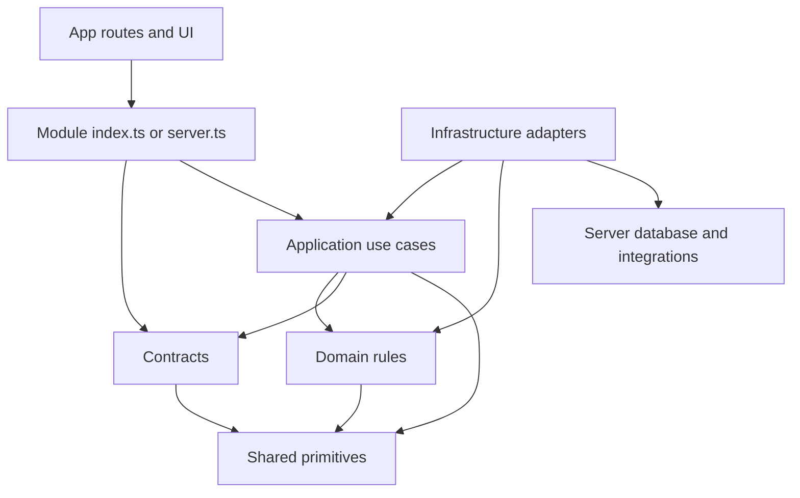
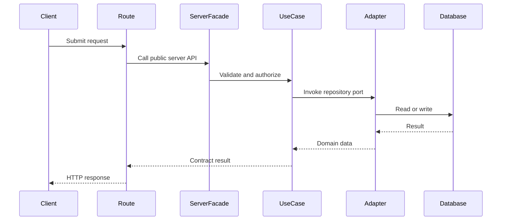

# Modular-monolith boundaries

Armani Caffe is one deployable Next.js application, not a set of microservices. Each business capability owns its rules, use cases, contracts, and future adapters. This task establishes boundaries, not business behavior or persistence implementations.

## Module map

| Module               | Responsibility and owned state                             | Public boundary                                                          |
| -------------------- | ---------------------------------------------------------- | ------------------------------------------------------------------------ |
| `auth`               | Identity, sessions, sign-in and sign-out policy            | Session/authentication contracts and server use cases                    |
| `admins`             | Administrative identities and access management            | Admin-management contracts and server use cases                          |
| `customers`          | Customer profiles and contact details                      | Customer contracts and server use cases                                  |
| `media`              | Media metadata, upload authorization, and object lifecycle | Media contracts and server use cases; MinIO remains private              |
| `settings`           | Store configuration and operational preferences            | Settings contracts and server use cases                                  |
| `catalog/categories` | Category hierarchy and visibility                          | Category contracts and server use cases                                  |
| `catalog/products`   | Products, options, prices, and availability presentation   | Product contracts and server use cases                                   |
| `carts`              | Mutable pre-order selections and totals                    | Cart contracts and server use cases                                      |
| `payments`           | Payment attempts, provider callbacks, and reconciliation   | Payment contracts and server use cases; provider adapter remains private |
| `orders`             | Order placement, lifecycle, and fulfillment state          | Order contracts and server use cases                                     |
| `inventory`          | Stock balances and movements                               | Inventory contracts and server use cases                                 |
| `invoices`           | Invoice issuance and immutable financial snapshots         | Invoice contracts and server use cases                                   |
| `printing`           | Print jobs and printer-bridge dispatch                     | Printing contracts and server use cases                                  |
| `analytics`          | Read models and operational reporting                      | Analytics query contracts and server use cases                           |
| `audit`              | Append-only accountability events                          | Audit contracts and server use cases                                     |
| `notifications`      | Delivery requests, templates, and status                   | Notification contracts and server use cases                              |

Every module has `domain/` (models and rules), `application/` (use cases and ports), `infrastructure/` (database/external adapters), and `contracts/` (transport-safe validation and DTOs). The root `index.ts` is the browser-safe public boundary and may export only pure domain and contracts. `server.ts` is the server-only public boundary for composed use cases. Both are deliberately empty until their corresponding features are implemented; consumers must not bypass them. Infrastructure files and `server.ts` directly import `server-only`.

`src/shared` contains only dependency-free, reusable primitives: branded Mongo-compatible IDs, integer toman money, bounded pagination, result/error types, UTC date handling, and permission checks. `src/server/database` contains server-only database utilities and the transaction runner port. It is not a shortcut for module-owned repositories.

## Allowed dependency direction

- Domain may use its own domain and shared primitives only. Contracts may additionally use their own domain. Neither imports React, Next.js, routes, or server infrastructure.
- Application may use its own application/domain/contracts, shared primitives, and **another module's public barrel**. It declares ports rather than importing its infrastructure.
- Infrastructure may use its own layers, shared primitives, and `src/server` services. It never imports another module's private files or persistence adapters.
- `index.ts` may expose only its domain/contracts. `server.ts` may compose its own layers. Cross-module imports are allowed only from application or `server.ts` through the other module's `index.ts` or `server.ts`.
- Routes and UI may use a module's public barrel but never its internal persistence. Client Components must not import `server.ts`; its `server-only` marker lets Next.js reject that at build time. No module imports an App Router handler.
- Local dependency cycles are forbidden. An application-level orchestration flow should call public use cases instead of letting repositories reach into one another.

The repository's `npm run check:architecture` parses static imports, re-exports, dynamic imports, and literal `require` calls. It checks all module layouts, import directions, server markers, and cycles. This complements TypeScript and `npm run check:boundaries`; it does not replace code review for non-literal dynamic imports.

## Request flow

This is the intended wiring pattern, not an implemented order endpoint yet.

Routes handle HTTP concerns, contracts validate input/output, application services coordinate work, domain rules protect invariants, and adapters own I/O. Transaction boundaries belong in application orchestration and are fulfilled by server-only database adapters.
